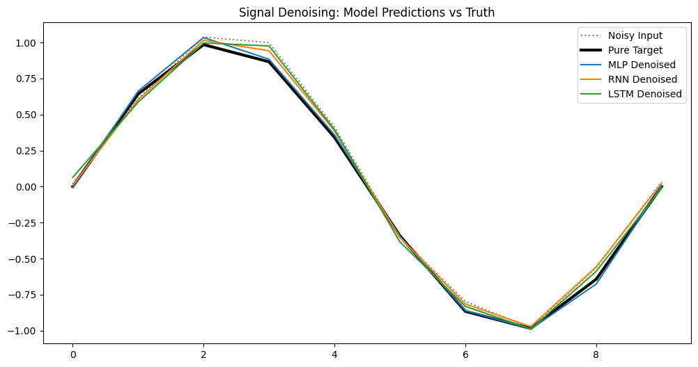
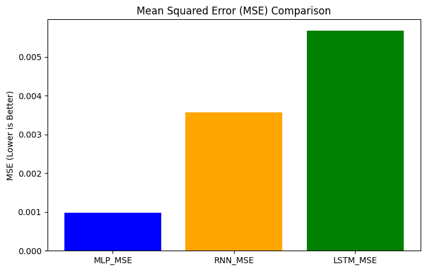
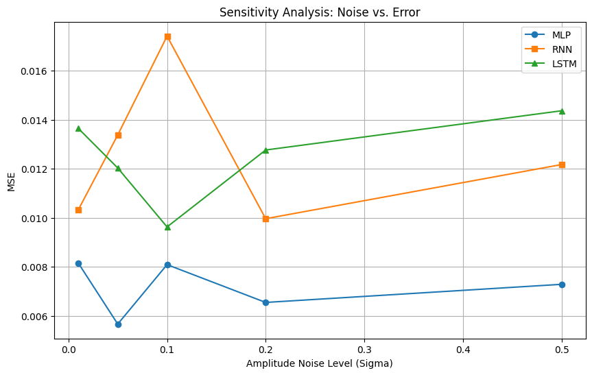

# Professional Signal Denoising

## Project Overview
This project implements a professional, highly-structured Python codebase for analyzing and denoising mathematical signals. The objective is to reconstruct a pure sine wave from a noisy input signal containing both amplitude and phase interference using PyTorch neural networks.

## 1. Theoretical Background & Methodology

### 1.1 The Nature of Signals
Every signal, regardless of complexity, can be decomposed into an infinite series of fundamental sine and cosine waves (Fourier analysis). To accurately recreate or predict a periodic sine signal digitally, we must sample it at least twice the frequency per second (Nyquist-Shannon sampling theorem). 

In this project, a signal sample is represented mathematically as a continuous series of numbers within a vector. We aim to extract a single, pure frequency from a mathematically combined signal.

### 1.2 Data Generation and Noise
To prevent our neural networks from simply memorizing the data (overfitting), we simulate real-world physical imperfections by injecting two types of noise into our dataset:
1. **Amplitude Noise ($\sigma$):** Vertical variance in the strength of the signal.
2. **Phase Noise ($\sigma_2$):** Horizontal variance in the timing of the signal.

The underlying formula for our noisy signal generation is:
$y = (A \pm \sigma)(\sin(2\pi f \phi + \sigma_2))$

### 1.3 The Context Window
Our dataset is built using a "sliding window" approach (similar to context windows in Large Language Models). We slice the continuous signal into discrete vectors of 10 samples. 

Each entry in our training dataset consists of:
* A 1-hot encoded vector $C$ representing the selected target frequency out of four known options.
* A scalar $\sigma$ representing the amplitude noise level as a percentage of the base amplitude $A$.
* The noisy input sample $S_c$ containing the interference.
* The clean target $Y$, containing 10 pure, noiseless samples.

---

## 2. Neural Network Architectures
We implemented and compared three standard deep learning architectures to map the noisy input $X$ to the clean target $Y$, evaluating them using Mean Squared Error (MSE).

### 2.1 Multi-Layer Perceptron (MLP)
The MLP is our baseline, fully connected architecture where every neuron connects to every neuron in the subsequent layer. Because the standard MLP lacks inherent memory of past states, it processes the entire 10-sample sliding window simultaneously as a flattened 1D vector (alongside the 1-hot frequency and noise parameters).

### 2.2 Recurrent Neural Network (RNN)
To capture temporal dependencies, we implemented an RNN. Unlike the MLP, each neuron in an RNN possesses independent memory. The new state relies on both the current input and the previous memory state: $y_t = f_w(x_t, y_{t-1})$. 

* **Theoretical Application:** Standard RNNs struggle with massive context windows due to the vanishing gradient problem (e.g., forgetting a character introduced at the beginning of a long book). However, for our specific 10-sample window and high-frequency signals, the RNN is mathematically well-suited, as it requires remembering fewer sequential samples to recognize the underlying periodic pattern.

### 2.3 Long Short-Term Memory (LSTM)
To address the limitations of the standard RNN, the LSTM utilizes internal gating mechanisms (via element-wise products) to selectively open and close information channels. This allows the network to isolate different attributes of the signal vector, maintaining a robust memory of the pure frequency over time while actively discarding the localized Gaussian noise.

---

## 3. Results & Visualizations

### 3.1 Signal Reconstruction
The models successfully learned to smooth out the localized Gaussian noise. As seen in the comparison below, the MLP and LSTM tracked the pure target almost perfectly. The standard RNN struggled slightly at the extreme peaks and troughs of the wave, slightly overestimating the amplitude.

### 3.2 Performance Comparison (MSE)
Empirically, the MLP achieved the lowest final Mean Squared Error (0.000982), followed by the RNN (0.003565) and LSTM (0.005684). While theoretically LSTMs are superior for complex sequence memory, the fixed 10-sample sliding window and the simple, highly predictable periodic nature of a sine wave allowed the MLP to easily map the flattened 1D inputs directly to the outputs. The recurrent models, which pass states sequentially, likely accumulated slight fractional errors from the noise at each time step.

### 3.3 Sensitivity Analysis
When expanding the noise range, the MLP remained highly robust and stable across all tested amplitude noise levels (from $\sigma = 0.01$ to $0.5$). The recurrent models (RNN and LSTM) showed higher variance and instability as amplitude noise increased, likely due to the noise compounding through their hidden states over the 10-step sequence.

---

## Appendix A: Project Constraints & Compliance
* **Architecture:** 100% strict SDK pattern. No business logic in execution scripts.
* **Code Quality:** PEP-8 compliant (Ruff verified) and adheres to the 150-line maximum file length rule.
* **Testing:** 96% coverage achieved via `pytest` for all mathematical generation and neural network dimensions.

## Appendix B: Prompt Engineering Log
* **Prompt 1:** "Write a mathematically accurate sine wave generator using numpy. Include amplitude noise ($\sigma$) and phase noise ($\sigma_2$)."
* **Prompt 2:** "Write PyTorch models for an MLP, an RNN, and an LSTM to process 10-sample time series data. Put them in src/services/models.py. Ensure the code uses a base mixin to avoid duplication."
* **Prompt 3:** "Create a matplotlib script to compare the predicted outputs of the three models against the pure target signal, and save the plot as a PNG."