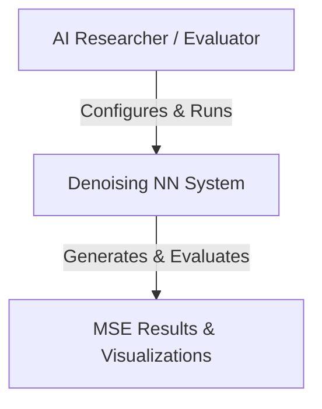
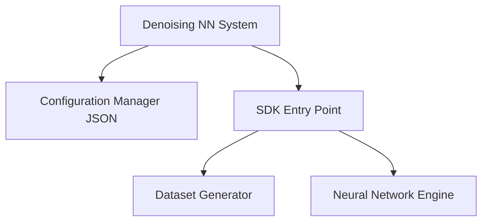
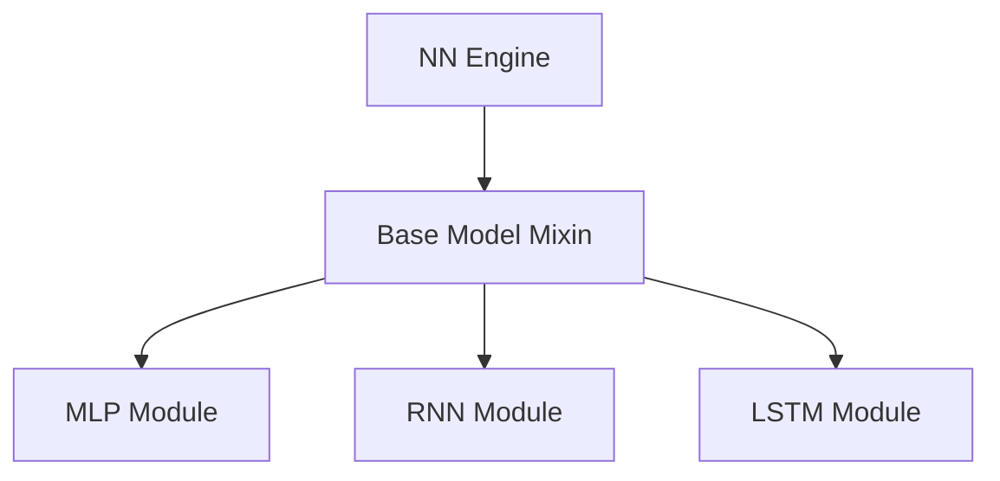
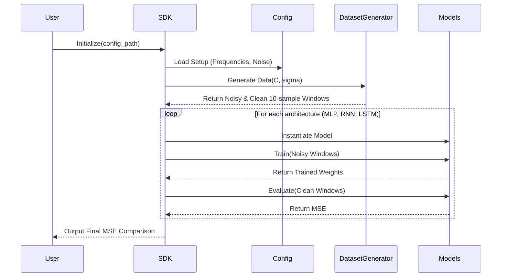
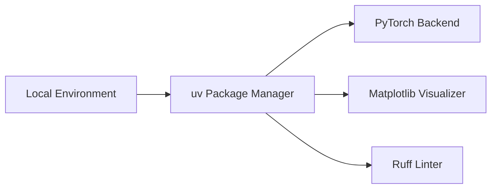

# Architecture Plan

This document outlines the technical architecture, design decisions, and system interfaces for the Denoising Sine Waves project, conforming to professional software engineering standards.

## 1. C4 Model Diagrams

### Level 1: System Context

### Level 2: Container

### Level 3: Component (Neural Network Engine)

### Level 4: Code
*Implemented via strict OOP principles in Python, ensuring files do not exceed 150 lines, with no duplicated logic across the MLP, RNN, and LSTM classes.*

---

## 2. UML & Deployment Diagrams

### Complex Process Sequence (Training Flow)

### Deployment Diagram

---

## 3. Architectural Decision Records (ADRs)

### ADR 1: Dependency & Environment Management
- **Alternative Considered:** Standard `pip` and `venv`.
- **Decision:** Use `uv` exclusively as the package manager and runner.
- **Rationale:** Required by strict project guidelines to ensure high-speed, deterministic dependency resolution (`uv.lock`).
- **Trade-offs:** Steeper learning curve compared to standard `pip`, but guarantees perfect environment reproducibility.

### ADR 2: Centralized SDK Architecture
- **Alternative Considered:** Direct execution of scripts via CLI arguments or multiple main entry files.
- **Decision:** Implement a centralized SDK layer (`src/sdk/sdk.py`).
- **Rationale:** Isolates business logic from the consumer interface. External consumers (like the Jupyter Notebook or tests) interact only with the SDK.
- **Trade-offs:** Adds a layer of abstraction, but vastly improves testability and modularity.

### ADR 3: Neural Network OOP Design
- **Alternative Considered:** Independent implementations of MLP, RNN, and LSTM PyTorch modules.
- **Decision:** Use a shared Base Class / Mixin for standard neural network operations (data loading, training loop, evaluation).
- **Rationale:** Prevents code duplication (DRY principle) and ensures compliance with the maximum 150-line per file constraint.
- **Trade-offs:** Slight increase in class inheritance complexity.

---

## 4. API Documentation, Data Schemas, and Contracts

### Data Schema
- **Input Frequency Vector ($C$):** 1-hot encoded vector representing the 4 configured frequencies.
- **Input Noise ($\sigma$):** Float representing noise percentage relative to amplitude $A$.
- **Input Data Shape:** `[Batch Size, 10 + len(C) + 1]` (10 noisy samples + 1-hot vector + noise scalar).
- **Target Data Shape:** `[Batch Size, 10]` (10 clean samples representing the ground truth).

### Internal API Contracts

#### `DatasetGenerator`
- `generate_batch(frequencies: List[float], noise_level: float, batch_size: int) -> Tuple[Tensor, Tensor]`
  - **Contract:** Generates synthetic data based on $y = (A \pm \sigma)(\sin(2\pi f \phi + \sigma_2))$. Returns a tuple of `(X_noisy, Y_clean)` ensuring the context window is exactly 10 samples.

#### `SDK`
- `run_pipeline(config_path: str) -> Dict[str, float]`
  - **Contract:** Orchestrates data generation and training. Initializes the environment using parameters from `setup.json`. Returns a dictionary mapping model names to their respective MSE scores (e.g., `{'MLP': 0.12, 'RNN': 0.05, 'LSTM': 0.02}`).